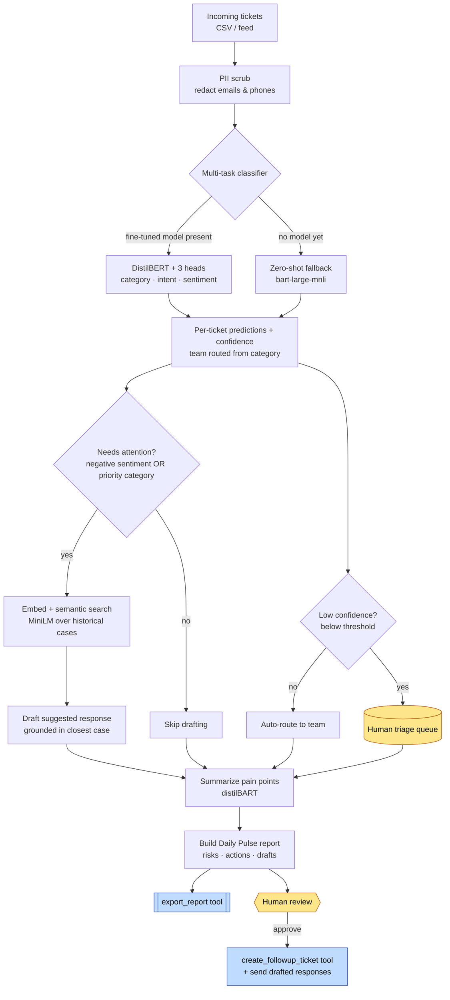

# InsightFlow AI — Architecture & Workflow

The Enterprise Pulse Agent turns a stream of support tickets into a daily
business "pulse": *detect → understand → summarize → recommend → act*, with a
human in the loop before anything is acted on.

## Workflow diagram



## Components → brief mapping

| Component | File | Brief topic |
|-----------|------|-------------|
| Multi-task classifier (trainable) | `notebooks/train_ticket_classifier.ipynb`, `src/classifier/` | Encoder models, fine-tuning, zero-shot classification |
| Semantic retrieval | `src/retriever.py` | Embeddings, semantic search, Knowledge Q&A |
| Pain-point summarizer | `src/summarizer.py` | Decoder / encoder-decoder summarization |
| Response drafter | `src/responder.py` | Scalable text generation (safe, templated) |
| Daily Pulse report | `src/report.py` | Report Generator module |
| Tools (search / ticket / export) | `src/tools.py` | LangChain agents + tool use |
| Orchestration | `src/pulse_agent.py` | LangChain-style multi-step workflow |

## Human-in-the-loop checkpoints

1. **Low-confidence triage** — any ticket whose category/sentiment confidence
   falls below `agent.low_confidence_threshold` (config) is queued for a human
   instead of auto-routed.
2. **Report review** — the daily report explicitly labels every drafted
   response a `[DRAFT — review before sending]` and lists escalations and
   recommended actions as *suggestions*.
3. **Action gate** — `create_followup_ticket` and sending responses only happen
   after human approval; nothing is dispatched automatically.

## Responsible-AI hooks

- **Privacy:** `scrub_pii()` redacts emails/phones before any model call.
- **Uncertainty:** confidence scores are surfaced and drive the triage queue.
- **Weak labels disclosed:** sentiment is distilled from a teacher model and
  inherits its biases — flagged as a limitation, not treated as ground truth.
- **Safety:** responses are template-grounded in real past resolutions, not
  free-form generation; nothing is auto-sent.
- **Cost/latency:** one small shared encoder serves three tasks per forward pass,
  matching CPU-serving constraints; the heavy training runs offline on Kaggle.

## Data flow contract

The label schema in `config/config.yaml` is the single source of truth, and the
fine-tuned model additionally carries its own label order in `label_maps.json`,
so a model trained on Kaggle loads and predicts correctly with no glue code.
`inference.py` verifies the saved heads match the configured `learned_heads`
(category / intent / sentiment) and falls back to zero-shot on a mismatch. The
saved artifact layout is:

```
insightflow_ticket_classifier/
├── config.json            # encoder architecture (HF)
├── model.safetensors      # fine-tuned encoder weights
├── tokenizer files
├── heads.pt               # {task: linear-head state_dict}
└── label_maps.json        # {base_model_name, head_labels}
```
